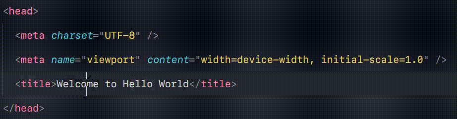
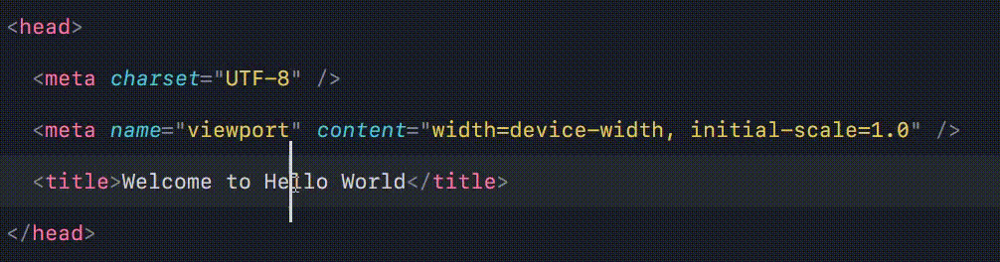
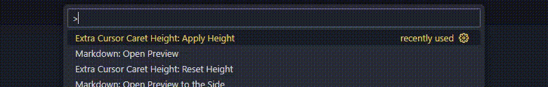

## 📐 Extra Cursor Caret Height

Make your cursor easier to see by increasing the caret (text cursor) height in VS Code. 
This extension is inspired by Sublime Text’s feature, aiming to improve visibility and comfort for users who prefer a more prominent text cursor during editing.

---

## Extension Marketplace

You can find and install the **Extra Cursor Caret Height** extension from the Visual Studio Code Marketplace here:

[Extra Cursor Caret Height - VS Code Marketplace](https://marketplace.visualstudio.com/items?itemName=shibbirweb.extra-cursor-caret-height)

---

### ✨ Features

* 🔼 Adds extra height to the blinking text cursor (caret).
* 🎯 Fully customizable — choose how tall you want the cursor to be.
* ♻️ Automatically replaces previous patches if reapplied.
* 🧼 Clean reset — patch is removed by reset command.

---

### 📸 Preview

#### 🔹 Regular Caret



---

#### 🔸 With Extra Caret Height Enabled



---

You can clearly see the difference between the default caret height and the enhanced version provided by the **Extra Cursor Caret Height** extension.

---

### 🛠️ Usage

1. Open the Command Palette (`Ctrl+Shift+P` or `Cmd+Shift+P`).
2. Search for `Extra Cursor Caret Height: Apply Height`.
3. Enter the desired height in pixels (e.g., `30`).
4. Exit the editor and reopen editor to see the changes.



✅ The new height will be applied after reload.

## Reset Height

1. To reset the height you can use the command: `Extra Cursor Caret Height: Reset Height`
2. Exit the editor and reopen editor to see the changes.

---

### 🔄 Reapplying

If you run the command again, it will:

* Remove the previous patch.
* Apply the new one.

---

### 🧹 Uninstallation/Revert

When the extension is deactivated or uninstalled, it:

* Please reset heigh using command `Extra Cursor Caret Height: Reset Height` before uninstall or deactivate.

---

### ⚠️ Disclaimer

>**Note:** It is **not recommended** to use it with `"editor.cursorStyle": "underline"` or `"underlineThin"`, as these styles are not visually compatible with the caret height adjustment.

This extension modifies the internal file:

```
workbench.desktop.main.css
```

> Use with caution. If VS Code updates, the patch may be lost or reset.

Additionally, after the patch is applied, VS Code may show a warning:
> ⚠️ *"Your installation appears to be corrupted."*

This is expected behavior when internal files are modified and **does not indicate actual corruption** or malicious activity. The extension only makes a minimal, reversible change to enhance the caret height.

You can safely ignore the warning, or remove the patch by `Extra Cursor Caret Height: Reset Height` command and restarting VS Code.

---

### 👤 Author

**MD. Shibbir Ahmed**
🔗 [https://shibbirweb.github.io](https://shibbirweb.github.io)
📧 [shibbirweb@gmail.com](mailto:shibbirweb@gmail.com)
🐙 [@shibbirweb on GitHub](https://github.com/shibbirweb)
