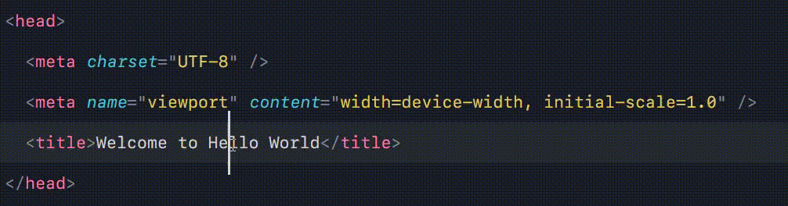
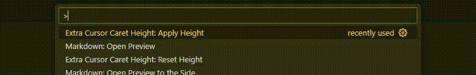

## 📐 Extra Cursor Caret Height

Make your cursor easier to see by increasing the caret (text cursor) height in VS Code. 
This extension is inspired by Sublime Text’s feature, aiming to improve visibility and comfort for users who prefer a more prominent text cursor during editing.

---

## Extension Marketplace

You can find and install the **Extra Cursor Caret Height** extension from the Visual Studio Code Marketplace here:

[Extra Cursor Caret Height - VS Code Marketplace](https://marketplace.visualstudio.com/items?itemName=shibbirweb.extra-cursor-caret-height)

> Using a VS Code fork (Cursor, Windsurf, VSCodium)? Those pull extensions from **[Open VSX](https://open-vsx.org/)** or let you install the `.vsix` manually.

---

### 📸 Preview

#### 🔸 With Extra Caret Height Enabled



---

A taller, more prominent caret provided by the **Extra Cursor Caret Height** extension.

---

### 🛠️ Usage

**Via Settings (recommended):**

1. Open Settings (`Ctrl+,` / `Cmd+,`) and search for **Extra Cursor Caret Height**.
2. Set **Height** to the desired pixels (default `30`).
3. Turn on **Enabled**.
4. Click **Reload Window** on the confirmation prompt (or run `Developer: Reload Window`) to see the changes.

**Via Command Palette:**

1. Open the Command Palette (`Ctrl+Shift+P` or `Cmd+Shift+P`).
2. Search for `Extra Cursor Caret Height: Apply Height`.
3. Enter the desired height in pixels (e.g., `30`).
4. Click **Reload Window** on the confirmation prompt.



✅ The new height is applied after the window reloads — no full restart needed.

> If VS Code cannot write to its own install directory (e.g. a root-owned `.deb`/`.rpm` or Program Files install), it will offer **Retry with Admin/Sudo** and prompt for elevated permissions. Read-only installs such as Linux **Snap** (`/snap/code/...`) cannot be patched.

## Reset Height

1. Turn off **Enabled** in Settings, or run the command `Extra Cursor Caret Height: Reset Height`.
2. Click **Reload Window** on the confirmation prompt to see the changes.

---

### ✨ Features

* 🔼 Adds extra height to the blinking text cursor (caret).
* 🎯 Fully customizable — set the exact height in pixels.
* ⚙️ Configure it right from the **Settings UI** (or the Command Palette).
* 🔁 Applies on a single **Reload Window** — no full restart needed.
* 🛟 **Auto-recovery** — a VS Code update wipes the patch; on the next launch the extension offers to re-apply your height.
* 🔐 Prompts for **Admin/Sudo** when the install directory needs elevated write permission.
* 🧩 Works on VS Code and its forks (Cursor, Windsurf, VSCodium) and older VS Code versions.
* 🧼 Clean reset — turn it off and the patch is removed.

---

### ⚙️ Settings

| Setting | Type | Default | Description |
| --- | --- | --- | --- |
| `extraCursorCaretHeight.enabled` | boolean | `false` | Master on/off. When enabled, the caret height patch is applied; when disabled, it is removed. |
| `extraCursorCaretHeight.height` | number | `30` | Total extra caret height in pixels. Applied only when **enabled** is on. |

Changing either setting patches (or removes) the change and prompts you to **Reload Window**.

---

### 🔄 Reapplying & updates

* Changing the height while enabled replaces the previous patch automatically.
* When VS Code **updates**, it replaces its internal files and the patch is lost. Because your settings are stored in `settings.json`, the extension detects this on the next launch and offers to **re-apply** your height.

---

### 🧹 Uninstallation / Revert

* Before uninstalling or disabling the extension, turn off **Enabled** (or run `Extra Cursor Caret Height: Reset Height`) and reload the window, so the patch is cleanly removed from VS Code's files.

---

### ⚠️ Disclaimer

>**Note:** It is **not recommended** to use it with `"editor.cursorStyle": "underline"` or `"underlineThin"`, as these styles are not visually compatible with the caret height adjustment.

This extension modifies the internal file:

```
workbench.desktop.main.js
```

> Use with caution. If VS Code updates, it replaces this file and the patch is lost. On the next launch the extension detects this and offers to re-apply your last height automatically.

Additionally, after the patch is applied, VS Code may show a warning:
> ⚠️ *"Your installation appears to be corrupted."*

This is expected behavior when internal files are modified and **does not indicate actual corruption** or malicious activity. The extension only makes a minimal, reversible change to enhance the caret height.

You can safely ignore the warning, or remove the patch by `Extra Cursor Caret Height: Reset Height` command and restarting VS Code.

---

### 👤 Author

**MD. Shibbir Ahmed**
🔗 [https://shibbirweb.github.io](https://shibbirweb.github.io)
📧 [shibbirweb@gmail.com](mailto:shibbirweb@gmail.com)
🐙 [@shibbirweb on GitHub](https://github.com/shibbirweb)
